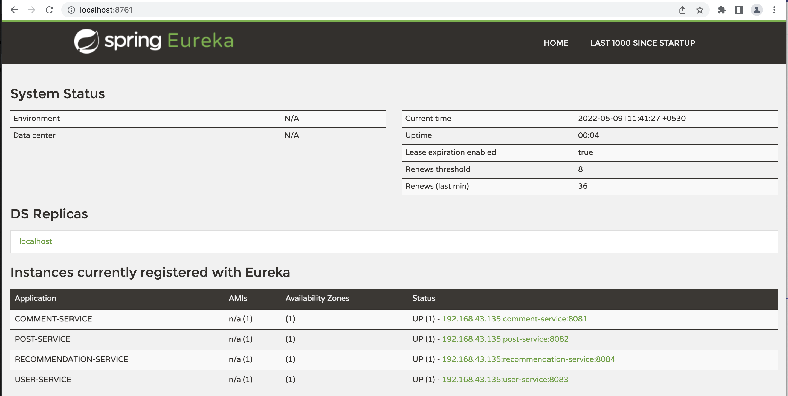
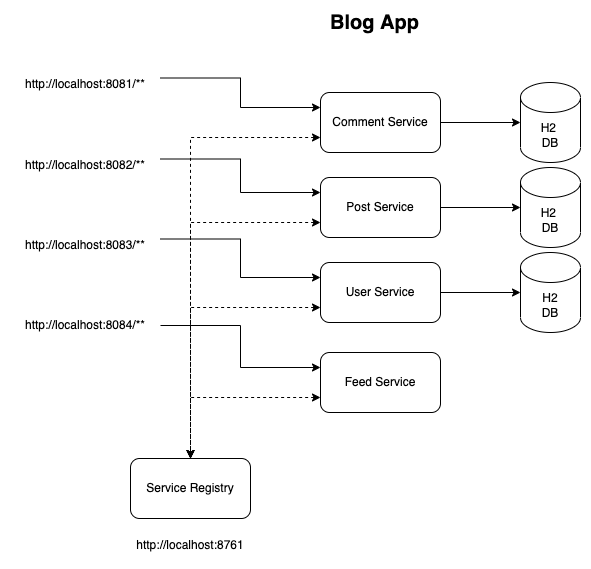
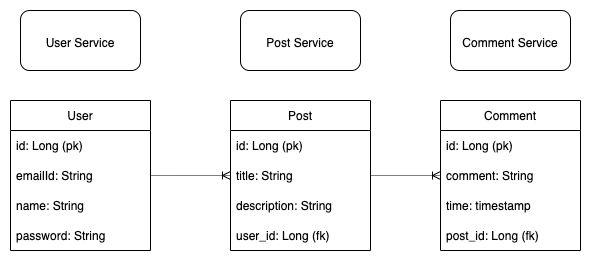

# Blog Application (Microservices)

### End Points

#### User Service
> http://localhost:8083/users

#### Post Service
> http://localhost:8082/posts

#### Comment Service
> http://localhost:8081/comments

#### Recommendation Service
> http://localhost:8084/feed

#### Eureka Server
> http://localhost:8761/

### Swagger UI

> http://localhost:port_number/swagger-ui.html

### Swagger API Docs

> http://localhost:port_number/v2/api-docs

### Actuators

> http://localhost:port_number/actuator/info, http://localhost:port_number/actuator/health etc..

## Architecture Diagram

## ER Diagram

